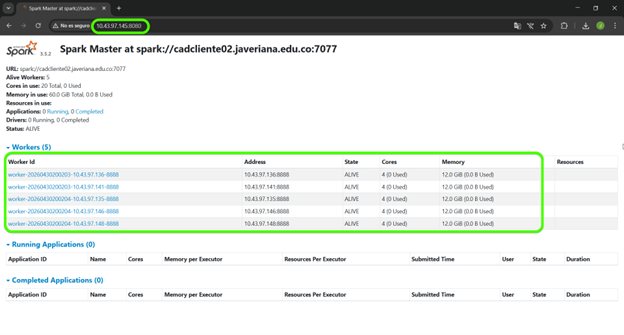

# Laboratorio ML00: Configuración de Clúster Apache Spark

Este repositorio documenta el procedimiento seguido para configurar un clúster de Apache Spark sobre máquinas virtuales con Linux Rocky. El objetivo del laboratorio fue dejar operativo un entorno distribuido compuesto por un nodo **master** y varios nodos **workers**, utilizando SSH sin contraseña, resolución local de nombres, almacenamiento compartido mediante NFS y configuración básica de Apache Spark.

## Tabla de contenido

1. [Objetivo](#objetivo)
2. [Arquitectura general](#arquitectura-general)
3. [Requisitos previos](#requisitos-previos)
4. [Paso 1: Configurar SSH sin contraseña](#paso-1-configurar-ssh-sin-contraseña)
5. [Paso 2: Configurar el archivo `/etc/hosts`](#paso-2-configurar-el-archivo-etchosts)
6. [Paso 3: Crear la carpeta compartida en el nodo master](#paso-3-crear-la-carpeta-compartida-en-el-nodo-master)
7. [Paso 4: Instalar y configurar NFS](#paso-4-instalar-y-configurar-nfs)
8. [Paso 5: Montar NFS en los workers](#paso-5-montar-nfs-en-los-workers)
9. [Paso 6: Instalar Apache Spark en la carpeta compartida](#paso-6-instalar-apache-spark-en-la-carpeta-compartida)
10. [Paso 7: Configurar variables de entorno](#paso-7-configurar-variables-de-entorno)
11. [Paso 8: Configurar Apache Spark](#paso-8-configurar-apache-spark)
12. [Paso 9: Iniciar Spark y verificar el clúster](#paso-9-iniciar-spark-y-verificar-el-clúster)
13. [Validación final](#validación-final)
14. [Conclusiones](#conclusiones)

## Objetivo

Configurar un clúster de Apache Spark utilizando máquinas virtuales con Linux Rocky, con el fin de habilitar procesamiento distribuido sobre varios nodos. La configuración incluye comunicación entre nodos, almacenamiento compartido y arranque del servicio Spark desde el nodo master.

## Arquitectura general

El clúster está compuesto por:

- Un nodo **master**, encargado de coordinar el clúster.
- Varios nodos **workers**, encargados de ejecutar tareas distribuidas.
- Un recurso compartido vía **NFS**, utilizado para que todos los nodos accedan a la instalación de Spark.
- Configuración de **SSH passwordless**, necesaria para que el master pueda iniciar procesos remotamente en los workers.

### Nodos utilizados

Durante el laboratorio se trabajó con los siguientes nombres e IPs:

| Rol | Hostname | IP |
|---|---|---|
| Master / cliente | `cadcliente02.javeriana.edu.co` / `cadcliente02` | `10.43.97.145` |
| Head node | `cadhead02.javeriana.edu.co` / `cadhead02` | `10.43.97.146` |
| Worker 0 | `cad02-w000.javeriana.edu.co` / `cad02-w000` | `10.43.97.141` |
| Worker 1 | `cad02-w001.javeriana.edu.co` / `cad02-w001` | `10.43.97.135` |
| Worker 2 | `cad02-w002.javeriana.edu.co` / `cad02-w002` | `10.43.97.136` |
| Worker 3 | `cad02-w003.javeriana.edu.co` / `cad02-w003` | `10.43.97.148` |
| Servidor NFS | `cad02-nfs01.javeriana.edu.co` / `cad02-nfs01` | `10.43.97.149` |

> Nota: Ajustar las IPs y nombres de host según el entorno donde se replique el laboratorio.

## Requisitos previos

Antes de iniciar, se debe contar con:

- Máquinas virtuales con Linux Rocky.
- Acceso por terminal a todos los nodos.
- Usuario con permisos para ejecutar comandos con `sudo`.
- Archivo comprimido de Apache Spark, por ejemplo:

```bash
spark-3.5.2-bin-hadoop3.tgz
```

- Conectividad de red entre el master, los workers y el servidor NFS.
- Java instalado o disponible para instalación.
- Python instalado en la ruta esperada por Spark.

## Paso 1: Configurar SSH sin contraseña

Desde el nodo master se configuró el acceso SSH sin contraseña hacia los workers. Esta configuración permite que Spark pueda iniciar procesos remotos sin requerir autenticación manual.

### 1.1 Generar el par de claves SSH en el master

```bash
ssh-keygen
```

Durante la generación de la clave, se puede aceptar la ruta por defecto presionando `Enter`.

### 1.2 Copiar la clave pública al master y a cada worker

```bash
ssh-copy-id master@<ip-del-master>
ssh-copy-id worker@<ip-del-worker>
```

Ejemplo general:

```bash
ssh-copy-id estudiante@10.43.97.141
ssh-copy-id estudiante@10.43.97.135
ssh-copy-id estudiante@10.43.97.136
ssh-copy-id estudiante@10.43.97.148
```


## Paso 2: Configurar el archivo `/etc/hosts`

En todos los nodos del clúster se editó el archivo `/etc/hosts` para agregar la resolución local de nombres. Esto permite que los nodos se comuniquen entre sí usando hostnames en lugar de depender únicamente de direcciones IP.

### 2.1 Abrir el archivo `/etc/hosts`

```bash
sudo nano /etc/hosts
```

### 2.2 Agregar las IPs y nombres de los nodos

```bash
################################################
# IP's Master/Workers
################################################
10.43.97.146 cadhead02.javeriana.edu.co cadhead02
10.43.97.141 cad02-w000.javeriana.edu.co cad02-w000
10.43.97.135 cad02-w001.javeriana.edu.co cad02-w001
10.43.97.136 cad02-w002.javeriana.edu.co cad02-w002
10.43.97.148 cad02-w003.javeriana.edu.co cad02-w003
10.43.97.145 cadcliente02.javeriana.edu.co cadcliente02
10.43.97.149 cad02-nfs01.javeriana.edu.co cad02-nfs01
```

Guardar el archivo y salir del editor.

## Paso 3: Crear la carpeta compartida en el nodo master

En el nodo master se creó el directorio que será compartido mediante NFS.

### 3.1 Ir al directorio raíz

```bash
cd /
```

### 3.2 Crear la carpeta compartida

```bash
sudo mkdir /nfs/condor -p
```

### 3.3 Asignar permisos al usuario correspondiente

```bash
sudo chmod estudiante:estudiante nfs/condor
```

> Nota: Dependiendo del sistema, puede ser necesario usar `chown` para cambiar propietario y grupo:
>
> ```bash
> sudo chown estudiante:estudiante /nfs/condor
> ```


## Paso 4: Instalar y configurar NFS

Se instaló y habilitó el servicio NFS en el nodo encargado de compartir el directorio con los workers.

### 4.1 Editar el archivo `/etc/exports`

```bash
sudo nano /etc/exports
```

### 4.2 Agregar la regla de exportación

```bash
/nfs/condor <ip_cliente>(rw,no_root_squash,subtree_check,fsid=0)
```

Ejemplo:

```bash
/nfs/condor 10.43.97.0/24(rw,no_root_squash,subtree_check,fsid=0)
```

> Nota: La IP o rango de red debe ajustarse según la infraestructura real.

### 4.3 Instalar utilidades NFS

```bash
sudo dnf install nfs-utils
```

### 4.4 Habilitar el servicio NFS

```bash
sudo systemctl enable nfs-server
```

### 4.5 Iniciar el servicio NFS

```bash
sudo systemctl start nfs-server
```

### 4.6 Verificar el estado del servicio

```bash
sudo systemctl status nfs-server
```

## Paso 5: Montar NFS en los workers

En cada nodo worker se creó el directorio de montaje y se conectó la carpeta compartida del master o servidor NFS.

### 5.1 Crear el directorio de montaje en cada worker

```bash
cd /
sudo mkdir -p nfs/condor
```

### 5.2 Montar la carpeta compartida

```bash
sudo mount 10.43.97.149:/nfs/condor /nfs/condor
```

### 5.3 Verificar el montaje

```bash
df -h
```

La salida debe mostrar el recurso NFS montado en `/nfs/condor`.

## Paso 6: Instalar Apache Spark en la carpeta compartida

Desde el nodo master se copió el archivo comprimido de Spark a la carpeta compartida y se descomprimió. Esto permite que todos los nodos accedan a la misma instalación de Spark a través de NFS.

### 6.1 Copiar el archivo de Spark

```bash
cp /home/estudiante/spark-3.5.2-bin-hadoop3.tgz /nfs/condor/apps
```

> Nota: Si la carpeta `/nfs/condor/apps` no existe, crearla primero:
>
> ```bash
> mkdir -p /nfs/condor/apps
> ```

### 6.2 Entrar a la carpeta de aplicaciones

```bash
cd /nfs/condor/apps
```

### 6.3 Descomprimir Spark

```bash
tar -zxvf spark-3.5.2-bin-hadoop3.tgz
```

### 6.4 Renombrar la carpeta de Spark

```bash
mv spark-3.5.2-bin-hadoop3 Spark
```

### 6.5 Instalar Java en master y workers

```bash
sudo dnf install openjdk-8-jdk-headless
```

### 6.6 Verificar la instalación de Java

```bash
java -version
```

## Paso 7: Configurar variables de entorno

En todos los nodos se configuraron las variables de entorno necesarias para Spark y Python.

### 7.1 Verificar variables actuales de Spark

```bash
env | grep -i SPARK
```

### 7.2 Editar el archivo `.bashrc`

```bash
cd
nano .bashrc
```

### 7.3 Agregar las variables de entorno

Agregar las siguientes líneas al archivo `.bashrc`:

```bash
export SPARK_HOME="/nfs/condor/Spark"
export SPARK_CONF_DIR="$SPARK_HOME/conf"
export PATH="$SPARK_HOME/bin":$PATH
export PYSPARK_PYTHON="/usr/local/bin/python3"
export PYSPARK_DRIVER_PYTHON="/usr/local/bin/python3"
```

> Nota: Si Spark fue instalado en `/nfs/condor/apps/Spark`, ajustar `SPARK_HOME` de la siguiente forma:
>
> ```bash
> export SPARK_HOME="/nfs/condor/apps/Spark"
> ```

### 7.4 Recargar la configuración

```bash
source .bashrc
```

### 7.5 Verificar nuevamente las variables

```bash
env | grep -i SPARK
```

## Paso 8: Configurar Apache Spark

Se configuraron los archivos principales de Spark: `spark-env.sh` y `workers`.

### 8.1 Entrar al directorio de configuración de Spark

```bash
cd /nfs/condor/apps/Spark/conf
```

> Nota: Si la instalación quedó directamente en `/nfs/condor/Spark`, usar:
>
> ```bash
> cd /nfs/condor/Spark/conf
> ```

### 8.2 Crear el archivo `spark-env.sh`

```bash
cp spark-env.sh.template spark-env.sh
```

### 8.3 Editar `spark-env.sh`

```bash
nano spark-env.sh
```

Agregar la configuración necesaria para el nodo master y los recursos disponibles. Ejemplo:

```bash
export SPARK_MASTER_HOST=10.43.97.145
export SPARK_WORKER_CORES=4
export SPARK_WORKER_MEMORY=12g
export SPARK_SCHEDULER_MODE=FAIR
```

> Nota: Ajustar la IP del master, número de cores y memoria de acuerdo con la infraestructura disponible.

### 8.4 Configurar el archivo `workers`

Crear o editar el archivo `workers`:

```bash
nano workers
```

Agregar la lista de nodos worker:

```bash
cad02-w000
cad02-w001
cad02-w002
cad02-w003
```

### 8.5 Instalar herramienta para verificar procesos Java

```bash
sudo dnf -y install java-1.8.0-openjdk-devel
```

### 8.6 Verificar procesos Java

```bash
jps
```

## Paso 9: Iniciar Spark y verificar el clúster

Una vez configurado Spark, se inició el clúster desde el nodo master.

### 9.1 Entrar al directorio `sbin`

```bash
cd /nfs/condor/Spark/sbin
```

O, si Spark está en `/nfs/condor/apps/Spark`:

```bash
cd /nfs/condor/apps/Spark/sbin
```

### 9.2 Iniciar todos los servicios de Spark

```bash
./start-all.sh
```

### 9.3 Verificar procesos activos

```bash
jps
```

En el master debe aparecer el proceso `Master`. En los workers debe aparecer el proceso `Worker`.

### 9.4 Verificar la interfaz web de Spark

Abrir en el navegador:

```text
http://10.43.97.145:8080
```

La interfaz debe mostrar los workers conectados y en estado `ALIVE`.

### Evidencia



## Validación final

La configuración se considera exitosa cuando:

- El master puede conectarse a los workers sin contraseña mediante SSH.
- Todos los nodos tienen correctamente configurado el archivo `/etc/hosts`.
- El recurso NFS está montado correctamente en los workers.
- Todos los nodos pueden acceder a la instalación compartida de Spark.
- Las variables de entorno de Spark están disponibles en todos los nodos.
- El comando `./start-all.sh` inicia correctamente el clúster.
- El comando `jps` muestra los procesos `Master` y `Worker` según corresponda.
- La interfaz web de Spark muestra los workers en estado `ALIVE`.

En el laboratorio realizado, la interfaz web permitió validar un clúster con workers activos, cores disponibles y memoria total lista para procesamiento distribuido.

## Conclusiones

La configuración del clúster permitió consolidar los pasos esenciales para desplegar Apache Spark en un entorno distribuido. El uso de SSH sin contraseña fue fundamental para que el master pudiera coordinar los procesos remotos en los workers. La configuración de `/etc/hosts` permitió asegurar la resolución local de nombres entre nodos, reduciendo dependencias externas de DNS.

El uso de NFS como almacenamiento compartido facilitó la administración de Spark, ya que todos los nodos pudieron acceder a la misma instalación sin duplicar manualmente los binarios en cada máquina. Además, la configuración de variables de entorno, archivos `spark-env.sh` y `workers` permitió adaptar Spark a los recursos disponibles en la infraestructura.

Finalmente, la verificación mediante `jps` y la interfaz web del Spark Master confirmó que el clúster quedó operativo y listo para ejecutar cargas de trabajo distribuidas de análisis de datos y machine learning.

## Estructura del repositorio

```text
.
├── README.md
├── docs/
│   ├── Lab_Spark00_Documentacion.pdf
│   └── images/
│       └── spark-master-ui.png
├── scripts/
│       ├── export_spark_env.sh
│       ├── install_java_process.sh
│       └── install_java.sh
```

## Referencias

- Apache Spark Documentation: https://spark.apache.org/docs/latest/
- Rocky Linux Documentation: https://docs.rockylinux.org/
- NFS Linux Manual Pages: https://man7.org/linux/man-pages/
